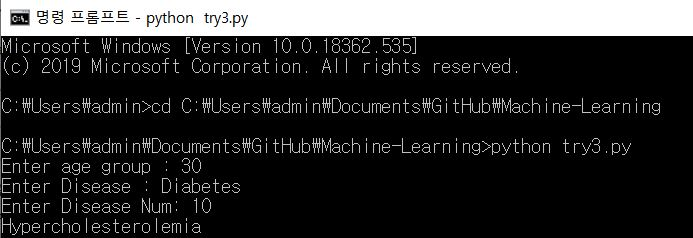

# Machine-Learning
*  Datasets
 1) 만성질환 약 리스트 ( from 약학정보원, 의약품 안전나라 )
    * 당뇨_의약품제품정보목록
    * 고혈압_의약품제품정보목록
    * 고콜레스테롤_의약품제품정보목록
    * 뇌졸중_의약품제품정보목록
    * 만성콩팥병_의약품제품정보목록
 2) 만성질환별 연령 분포 테이블 (from KOSIS)
    * 당뇨병_유병률_추이
    * 고혈압_유병률_추이
    * 고콜레스테롤혈증_유병률_추이
    * 고중성지방혈증_유병률_추이
    * 만성콩팥병_유병률_추이
* Methodology
  * k-NN algorithm(K-Nearest Neighbor Algorithm)
    * 입력 : 특징 공간 내 k개의 가장 가까운 훈련 데이터로 구성
    * 훈련 : 이웃으로 구성될 레이블 이웃은 항목(k-NN 분류의 경우)이나 객체 특성 값(k-NN 회귀의 경우)이 알려진 객체의 집합으로부터 구해진다. 이것은 명시적인 훈련 과정이 필요하지는 않지만, 알고리즘을 위한 훈련 집합이라고 생각될 수 있다.
    * 출력 : 소속된 항목이다. 객체는 k개의 최근접 이웃 사이에서 가장 공통적인 항목에 할당되는 객체로 과반수 의결에 의해 분류된다(k는 양의 정수이며 통상적으로 작은 수). 만약 k = 1 이라면 객체는 단순히 하나의 최근접 이웃의 항목에 할당된다.
* Evaluation & Analysis

약 알람의 가장 불편한 점은 약마다 알람을 사용자가 직접 입력을 해주어야 한다는 점이다. 우리 서비스의 주 사용층은 고령층이다보니 입력과정에서 복용중인 약물을 빠뜨릴 가능성도 높다. 이들을 위해 알람을 설정할 때 같이 설정해야할 것으로 예측되는 질병을 묻는 서비스를 구상하였다. 사용자의 알람 정보 속 약이름을 저장한 것을 바탕으로 같이 앓고 있을 가능성이 높은 질환을 물어보고, 이에 해당하는 알람도 설정할 것인지 묻는 서비스를 제공하고자 한다.
먼저, 약 이름별 ATC-Code를 확인하고 이를 통해 사용자가 앓고 있는 질환을 유추한다. k-nn알고리즘을 활용하여 연령대별 질환분포에서 사용자가 앓는 질병과 가장 가까운 거리에 있는 질환을 찾는다. 그리고 이를 앓고 있지는 않냐고 묻고 긍정으로 답할시 바로 알람 설정으로 넘어갈 수 있도록 하고자 한다.
우리가 구상중인 서비스가 잘 개발되었다면 특정 질환과 가장 가까운 거리의 분포에 위치한 질환을 도출할 것이다. 사용자가 앓고 있는 질환과 알고리즘을 통해 도출된 질환과의 거리를 확인하고 관계성을 입증함으로써 우리의 목표 구현성을 평가하고 분석할 예정이다.

* Result

